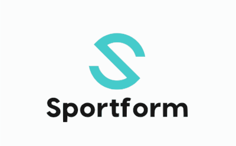
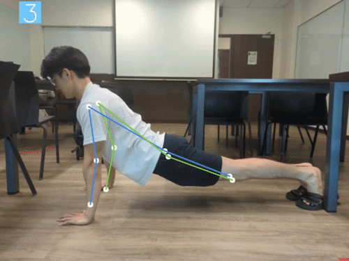

# SportForm

<div id="top"></div>

<div align="center">
  <a href="https://github.com/JasonYapzx/sportform">
    
  </a>

  <h3 align="center">SportForm</h3>

  <p align="center">
    Sportform offers AI-assisted Form Analysis that uses Computer Vision and Pose Estimation to evaluate videos uploaded by users. 
    <br />
    <a href="https://github.com/JasonYapzx/sportform/"><strong>Explore the docs »</strong></a>
    <br />
    <br />
    <a href="https://www.youtube.com/watch?v=ZICofXfZx4o">View Video Demo</a>
    ·
    <a href="https://sportform.vercel.app/">Try Demo deployed on Vercel</a>
    ·
    <a href="mailto: infinitysparkteam@gmail.com">Report Bug</a>
  </p>
</div>

## Frontend

### Inspiration
Covid-19 has presented society with many challenges, some of which include how education can be conducted in a socially-distanced world. Sportform was created to provide a solution to this challenge, primarily in physical education, by allowing technology to assist educators in providing the level of instruction required of them while embracing digital alternatives to physical classes. Sportform addresses key concerns of online physical education classes using web-conferencing, such that lack of accountability and supervision by using AI-powered tools to augment educators.

### What it does
Sportform is a Multimedia Forum-based Web Application for users to upload and review fitness videos with a keen focus on improving one's form and competency in their respective exercises/sports. Sportform offers AI-assisted Form Analysis that uses Computer Vision and Pose Estimation to evaluate videos uploaded by users. 

<p align="right">(<a href="#top">back to top</a>)</p>

### Built With

This section should list any major frameworks/libraries used to bootstrap your project. Leave any add-ons/plugins for the acknowledgements section. Here are a few examples.

- [![React][react.js]][react-url]
- [![Firebase][firebase]][firebase-url]
- [![Tailwind][tailwind]][tailwind-url]
- [![NextJS][nextjs]][nextjs-url]
- 
- 


<p align="right">(<a href="#top">back to top</a>)</p>

### Prerequisites

This is an example of how to list things you need to use the software and how to install them.

- npm
  ```sh
  npm install npm@latest -g
  ```

<p align="right">(<a href="#top">back to top</a>)</p>

### Installation

_Below is an example of how you can instruct your audience on installing and setting up your app. This template doesn't rely on any external dependencies or services._

1. Clone the repo
   ```sh
   git clone git@github.com:JasonYapzx/sportform.git
   ```
2. `cd` to `sportformfe` and install NPM packages
   ```sh
   cd sportformfe
   npm install
   ```
3. Get your Firebase config and store it in an `.env.local` file in the root directory of the project. For example this should be how your `.env` file looks like:
    ```sh
    NEXT_PUBLIC_FIREBASE_API_KEY={your_api_key}
    NEXT_PUBLIC_FIREBASE_AUTH_DOMAIN={your_auth_domain}
    NEXT_PUBLIC_FIREBASE_PROJECT_ID={your_project_id}
    NEXT_PUBLIC_FIREBASE_STORAGE_BUCKET={your_storage_bucket}
    NEXT_PUBLIC_FIREBASE_MESSAGING_SENDER_ID={your_messaging_sender_id}
    NEXT_PUBLIC_FIREBASE_APP_ID={your_app_id}
    NEXT_PUBLIC_FIREBASE_MEASUREMENT_ID={your_measurement_id}
    ```
4. If you want to try our a dev deployment just run `npm run dev` to start this NextJS application.
5. If you need to build for production, just run `npm run build` to build a production ready application.

<p align="right">(<a href="#top">back to top</a>)</p>


## Pose Estimation

SportForm generates annotations on user-uploaded videos, providing counts of successful repetitions for various exercises and checking the form of those exercises. It achieves this by utilizing a state-of-the-art object detection and pose estimation model, YOLOv8l-pose, developed by [ultralytics](https://github.com/ultralytics/ultralytics).This model accurately detects and generates 17 keypoints on the human body, including joints and facial features like ears.

<p align="center">
  
  <br />
   Repetition Counter
</p>
<br />
<p align="center">
  
  <br />
  Form Checker
</p>

SportForm takes in video uploads from users and utilizes the model to generate the coordinates of keypoints. By analyzing these keypoints, we calculate the necessary angles and distances to accurately evaluate exercise form and count repetitions.

In the future, there is a possibility of training deep neural networks for differnet catagories of exercises to accurately determine repetition count and evaluate form. However, at present, this endeavor is beyond our scope as it requires significant time and resources.

<p align="right">(<a href="#top">back to top</a>)</p>

### Prerequisites

The implementation of our pose estimation scripts are in a Python>=3.7 environment with [PyTorch>=1.7](https://pytorch.org/get-started/locally/) (ensure CUDA is enabled).

Other requirements will be installed together with YOLO by ultralytics, refer to their [documentation](https://github.com/ultralytics/ultralytics) for more information.
```sh
pip install ultralytics
```

<p align="right">(<a href="#top">back to top</a>)</p>

### Usage

#### CLI

Our script to generate video with annotations can be used from the Command Line Interface (CLI).

1. Enter the directory `/path/to/sportform/pose_estimation`
   ```sh
   cd /path/to/sportform/pose_estimation
   ```
   
2. Try video generation with our example for pushups
   ```sh
   python3 pushup_keypts.py -s=./pushup.mp4
   ```
   
3. Try video generation with our example for situps
   ```sh
   python3 situp_keypts.py -s=./situp.mp4
   ```

<p align="right">(<a href="#top">back to top</a>)</p>


## Roadmap
We hope to enhance the application further by adding a social media forum page whereby
users can critique and comment on other's forms and help one another to improve. Another way
where by people can learn from one another is to have a specialized video share feature for everyone
to stay connected and work out with one another virtually. This creates a cohesive space for virtual workouts!

<p align="right">(<a href="#top">back to top</a>)</p>

<!-- CONTACT -->

## Contact

Jeric Lew - [Linkedin](https://www.linkedin.com/in/jericlew) | [Github](https://github.com/JericLew)

Eiffel Leo - [LinkedIn](https://www.linkedin.com/in/eiffel-leo/) | [Github](https://github.com/JavonTeo)

Javon Teo - [LinkedIn](https://www.linkedin.com/in/javon-teo-tze-kai/) | [Github](https://github.com/EiffelLKF)

Jason Yap - [Linkedin](https://www.linkedin.com/in/ja-sony/) | [Github](https://github.com/JasonYapzx)

Project Link: [GitHub](https://github.com/JasonYapzx/sportform/)

<p align="right">(<a href="#top">back to top</a>)</p>


[react.js]: https://img.shields.io/badge/React-20232A?style=for-the-badge&logo=react&logoColor=61DAFB
[react-url]: https://reactjs.org/
[firebase]: https://img.shields.io/badge/firebase-%23039BE5.svg?style=for-the-badge&logo=firebase
[firebase-url]: https://firebase.google.com/
[tailwind]: https://img.shields.io/badge/tailwindcss-%2338B2AC.svg?style=for-the-badge&logo=tailwind-css&logoColor=white
[tailwind-url]: https://tailwindcss.com/
[nextjs]: https://img.shields.io/badge/Next-black?style=for-the-badge&logo=next.js&logoColor=white
[nextjs-url]: https://nextjs.org/
